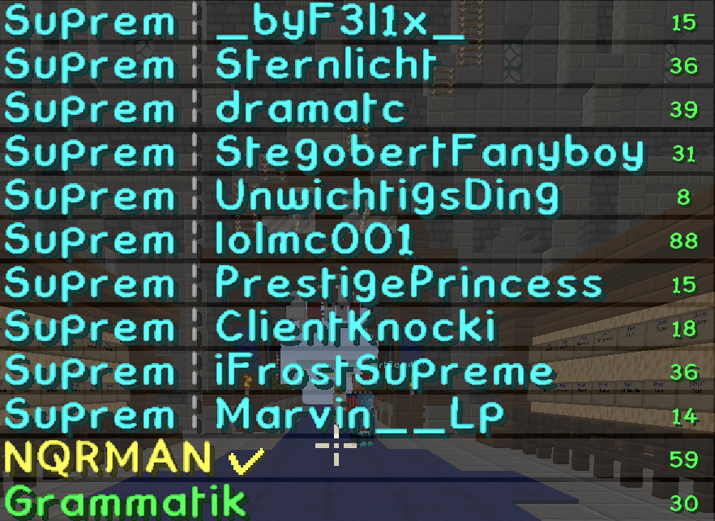
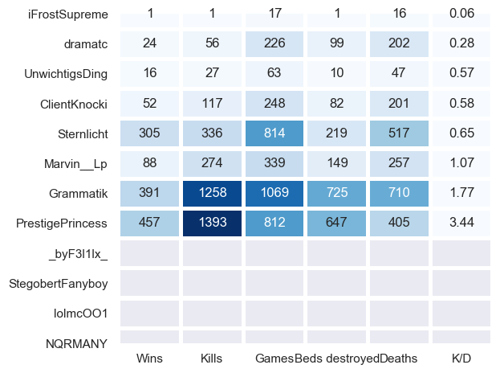

[](https://travis-ci.org/paulknewton/minecraft-stat-checker)
# minecraft-stat-checker
Tools to check Minecraft statistics of players.

Minecraft has a lot of statistics: wins, games, kills, deaths...

These statistics make a difference and help players understand who they are playing against. They can even be used to understand IF you want to play against someone. This tool allows you to get a summary of statistics for the players in a round by using a screenshot from a Minecraft game.

Let's walk through the scenario:

1. Get ready to join a Minecraft round

    Minecraft displays the players that are entering a round. This is shown at the top of the screen as list if players/teams:

    

1. Launch the tool

    The tool is launched (usually via a shortcut key). It prompts the user to take a screenshot of the area listing the usernames.

1. Build the stats

    The tool extracts usernames from the image using OCR (via Google Tesseract) and looks up statistics of each user (via online web services). These are displayed as a pop-up window:

    

1. Make the decision. Play or pass?

    Based on the statistics of the assembled players you can decide if it makes sense to jump into the round...or move on to fight another day.

## Installing
Clone the repo and install required packages via pip:
```
pip install -r requirements.txt
```

## Using the tool
The main program is mcstats:
```
python mcstats.py
```

It supports many command line parameters:
```
python mcstats.py -h
```
