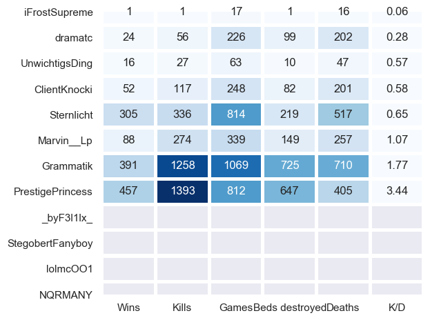

# minecraft-stat-checker
Tools to automatically check Minecraft statistics of players.

The users enters a Minecraft round. Minecraft displays the players that are entering...

The program extracts usernames using OCR (via Google Tesseract) and looks up statistics of each user. These are displayed as a pop-up:

